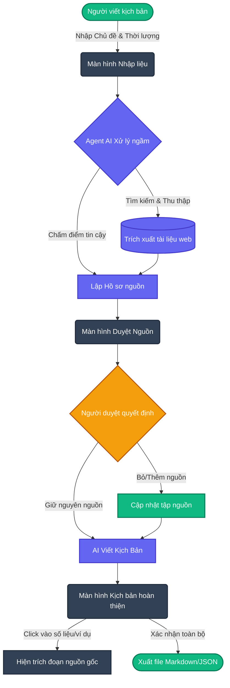

# Sơ đồ luồng hoạt động (CP2) - ScriptScout (Track C3)

Dưới đây là sơ đồ luồng các bước thao tác từ đầu đến cuối của tính năng ScriptScout. Nhóm có thể nộp file này (chứa sơ đồ Mermaid tự động vẽ trên GitHub) cho yêu cầu của Checkpoint 2.

### Chú thích luồng thao tác:
1. **Bắt đầu:** Người viết kịch bản vào màn hình nhập liệu, nhập các thông số (Chủ đề, Thời lượng, Đối tượng).
2. **AI xử lý:** Agent tự động lên mạng tìm kiếm, đọc hiểu tài liệu, lập danh sách nguồn và tự chấm điểm độ tin cậy.
3. **Duyệt nguồn:** Màn hình hiển thị danh sách các nguồn. Người dùng đọc và quyết định loại bỏ những nguồn không uy tín.
4. **Sinh kịch bản:** AI chỉ dựa trên các nguồn đã duyệt để viết ra kịch bản. Nếu có nguồn bị loại, AI chỉ viết lại đúng câu liên quan.
5. **Kết thúc:** Người dùng xem kịch bản. Các thông tin quan trọng đều bấm vào được để đối chiếu với tài liệu gốc. Sau đó bấm nút xuất file.
